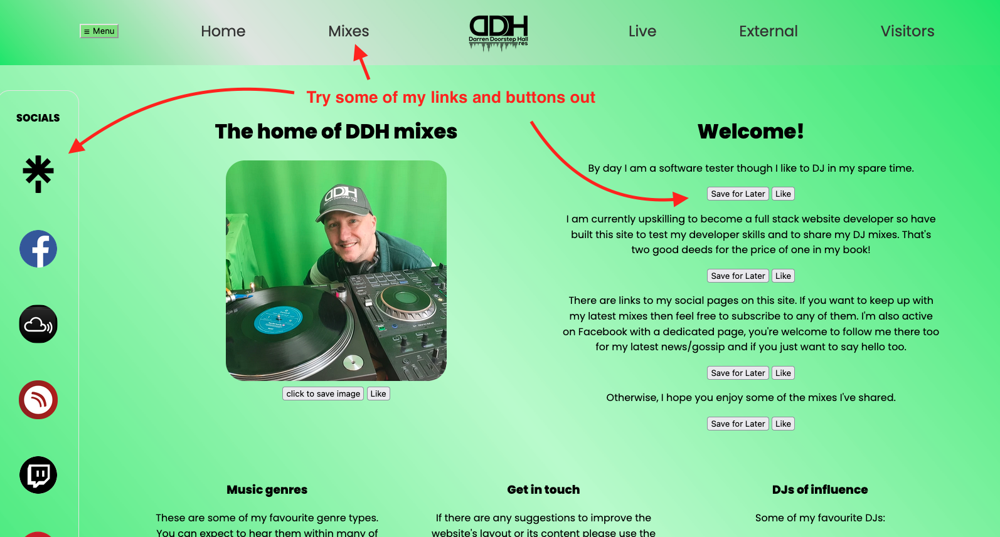

#PROJECT NAME: DDH Website

##Intro
This is a website I am developing as part of my HyperionDev Full Stack Web Bootcamp.

I am gradually learning technologies around the full stack so expect to see work around HTML, CSS, SCSS, Javascript, jQuery and more to more to follow.

##TABLE OF CONTENTS FOLLOWS

###Installation
[A link to the installation](install.md)

###Usage
The website contains lots of links and buttons. Give some of them a try!

###Credits
Credit to the Hyperion team for the help they've given me.

Shoutouts to the mentors that I've spoken to that have helped me, given me advice, articles to read/view and for the feedback on all of my submissions.
